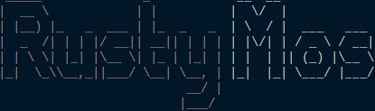

<center></center>

Rusty Mos 是一个使用 Rust 语言编写、移植自**北航操作系统课程**实验系统 MOS，具备与原 MOS 兼容的特性，并提供了基于伙伴系统的内核态**全局分配器**（`Global Allocator`），以及支持进程间多页通信的**共享内存池机制**，**动态异常入口**等新增内容。

## 文档、获取以及构建、运行

### 你需要准备

- Rust 工具链（要求使用 nightly 版本），并包含下列组件：
  - `rust-src`, `llvm-tools`, `rust-docs`, `clippy`
- QEMU 模拟器，需要使用下列内容运行内核：
  - `qemu-system-mipsel`
- mips-gcc 交叉编译工具（**若只构建内核则不需要**），需要使用下列内容：
  - `mips-linux-gnu-gcc`, `mips-linux-gnu-ld`
- 构建工具：
  - `make`


### 获取文档

在线阅读：[https://swkfk.github.io/Rusty-Mos/rusty_mos/index.html](https://swkfk.github.io/Rusty-Mos/rusty_mos/index.html)。

或者在此仓库的 `docs` 分支获取，页面入口位于 `rusty_mos/index.html`。

或者在获取仓库后，使用 `make doc` 构建，生成文件将位于 `doc` 文件夹中，页面入口位于 `doc/rusty_mos/index.html`。


### 代码获取

此仓库包含了**内核代码**，同时存在用户代码的**子模块**。

项目仓库：[https://github.com/swkfk/Rusty-Mos](https://github.com/swkfk/Rusty-Mos)。

子模块仓库：[https://github.com/swkfk/Mos-User](https://github.com/swkfk/Mos-User)。

克隆仓库：

```sh
git clone https://github.com/swkfk/Rusty-Mos.git --recursive
cd Rusty-Mos
```

### 内核与用户应用的构建与运行

使用下列指令可以**构建** `Debug` 模式的内核与用户应用并通过 QEMU **运行**：

```sh
make run
```

设置 `MOS_RELEASE` 环境变量可在 `Release` 模式下**构建并运行**：

```sh
MOS_RELEASE=1 make run
```

若只进行构建，则可使用 `build` 这一构建目标。

使用 `test` 这一构建目标，可以在两个模式下运行内核的**单元测试**：

```sh
[MOS_RELEASE=1] make test
```

若只构建内核，可通过 `cargo` 进行：

```sh
MOS_BUILD=1 cargo build --target mipsel-unknown-none [--release]
```

### 版本要求

能通过下列版本的 Rust 的构建：

- `rustc 1.80.0-nightly (8f9080db4 2024-05-09)`
- `rustc 1.80.0-nightly (8c127df75 2024-05-16)`

能通过最新版本 `rust clippy` 的静态检查（借助 Github Action 进行）。

在下列版本的 `qemu-system-mipsel` 中通过测试：

- `QEMU emulator version 6.2.0 (Debian 1:6.2+dfsg-2ubuntu6.17)`
- `QEMU emulator version 9.0.1`


## 项目数据

**Rust 代码总行数**：`3908`，包含 `942` 行注释与 `467` 行空行。

此外还有对链接脚本、Makefile、用户程序、汇编代码的编写与修改未统计。

**版本管理提交信息**：截至 `d64a3c` 版本，共 `161` 次提交，包含：

- `[Feat]` 核心功能开发，`58` 次提交
- `[Refa]` 代码重构，`12` 次提交
- `[Test]` 代码测试，`17` 次提交
- `[Fix]` Bug 修复，`30` 次提交
- `[Subm]` 用户程序子模块，`7` 次提交
- `[Doc]` 文档注释，`14` 次提交
- `[Mk]` Makefile 及构建脚本，`10` 次提交
- `[Repo]` 与仓库相关，`12` 次提交
- `[Init]` 初始化仓库，`1` 次提交

**Unsafe 代码**：使用 `cargo geiger` 获取，结果如下：

| Functions | Expressions | Impls | Traits | Methods |
|:---------:|:-----------:|:-----:|:------:|:-------:|
|   `7/7`   |  `430/430`  | `3/3` |  `0/0` |  `2/2`  |

`unsafe` 代码集中在对**页表相关裸指针**的直接读写上，同时，内核中部分使用了**基于指针构建的链表**，也是 `unsafe` 代码较为集中的部分。


## 内核介绍

### 内存管理

使用页式内存管理，以 `4 KB` 大小划分物理页面。基本管理逻辑与原 MOS 保持一致，并使用基于指针的双向链表（`utils::linked_list`）进行空闲页面的管理。

在此基础上，我基于伙伴系统构建了一个内核的**内存分配器**（`memory::buddy_allocator`）以及用于多页 IPC 的共享内存池（`memory::shared_pool`）。


#### 伙伴系统分配器

以 **一页** 为最小的分配单位，提供 `2^0`，`2^1`，`2^2`，等页面数的分配。

在这个实现中，称之为 `category`（类别），最小的级别为 `0`，最高为 `CCOUNT - 1`，`CCOUNT` 为一个常数泛型，在内核中设置为 `4`，最高可分配 8 个页面，`32 KB` 大小。

对于页面数大于 1 的情况，使用**地址最低的**页面作为代表插入队列。

在**分配**时，会计算所需要的页面数，并向上取到 2 的幂次。首先在对应的空闲页面列表中查找，若不存在，则会依次向更高级别的列表中查找。并取用地址最低的页面，将剩余页面插入低级别的队列中。

在**释放**时，同样会计算页面数，并将页面插入到对应链表，如果存在其伙伴，则将它们移除，并插入更高级别的列表中。这个过程递归进行。

内核单元测试中，`ketnel_tests::test_buddy_alloc` 是对伙伴系统的测试，使用 `make test` 可以执行测试。


#### 共享内存池

共享内存池可以提供不定页数的、不定进程数的内存共享。

内核维护一个共享内存池的情况，包括**共享的页面列表**、**参与共享的进程列表**、**写锁**。

进程通过系统调用创建一个共享内存池，**并分配页面**：

```rust
fn sys_create_shared_pool(va: u32, len: u32, perm: u32) -> u32;
```

- `va` 起始虚拟地址，要求按照页面对齐。
- `len` 需要申请的内存大小，会向上取整分配页面。
- `perm` 页面的权限位，用户态软件添加 `PTE_D` 与 `PTE_POOL`。

返回页面的 `id` 或者错误码。该系统调用会申请页面，标记为共享，并会将他们映射到该进程指定的虚拟地址处。

其他进程可以通过系统调用来**加入某一个内存池**：

```rust
fn sys_bind_shared_pool(va: u32, id: u32, perm: u32) -> u32;
```

- `va` 起始虚拟地址，要求按照页面对齐。
- `id` 需要申请加入的内存池的 `id`。
- `perm` 页面的权限位，用户态软件添加 `PTE_D` 与 `PTE_POOL`。

返回 `0` 或者错误码。

同一个进程不可以对一个内存池绑定两次，参与共享的进程之间不需要有任何关系。绑定时，内核会将该内存池的全部页面按照原有顺序一一映射到进程的虚拟地址。

当进程结束时，会解除自己的绑定，当全部的进程解除绑定，会**自动销毁内存池**，页面也会被回收，内存池无法再次被绑定。

进程可以通过系统调用获取内存池的锁，或者解锁：

```rust
fn sys_lock(id: u32) -> u32;
fn sys_unlock(id: u32) -> u32
```

- `id` 操作的内存池的 `id`。

仅绑定的进程可以参与加锁、解锁。仅加锁的进程可以解锁，进程销毁时，也会**自动释放自己的锁**。

内核单元测试中，`ketnel_tests::test_memory_pool` 是对内存池的数据结构层面的测试，使用 `make test` 可以执行测试。


### 异常处理

异常处理与原有 MOS 采用一样的逻辑，并提供 Rust 实现的处理函数。此外，还实现了异常处理入口的动态设置（`arch_mipsel::trap::set_exc_base`）。


#### 动态异常入口

通过链接脚本，获取异常处理段放置的地址 `exc_handler`，并在内核启动时，通过 `mtc0` 指令写入 `EBase` 寄存器。


### 进程管理

进程管理与原 MOS 采用一样的逻辑，且没有进行调度算法的探索。但是使用**基于数组的链表**进行管理，代码更加简单、安全。

内核单元测试中，`ketnel_tests::array_link_list` 是对链表的测试，使用 `make test` 可以执行测试。


## 用户态新增内容与测试程序

### 新增库函数

- `int create_mem_pool(void *va, u_int len, u_int writeable)`
  - 创建内存池，对系统调用的封装
  - 可设置可写或只读
- `int bind_mem_pool(void *va, u_int id, u_int writeable)`
  - 绑定内存池，对系统调用的封装
  - 可设置可写或只读
- `int try_bind_mem_pool(void *va, u_int id, u_int writeable)`
  - 可循环进行绑定尝试，直到成功
  - 好像没啥意义，我也不记得为啥会写这个了
- `void mem_pool_lock(u_int id)`
  - 对内存池上锁，并循环尝试，直到成功
- `int mem_pool_unlock(u_int id)`
  - 解锁内存池


### 新增测试程序

- `testpool`
  - 对共享内存池的相关内容进行较为全面的测试，包括锁与数据冒险
- `testlockdestory`
  - 测试进程结束后对锁的自动释放
- `testforklib`
  - 测试 `fork` 与递归函数的执行情况
- `testforkdestory`
  - ~~目前**已知内核 Bug**的最小实现，当 `fork` 的子进程立即退出时，有一定概率出发内核崩溃，原因未知~~
  - 该 Bug 已由 [@Qin-shihuang](https://github.com/Qin-shihuang) 大佬修复


### 用户程序改进

- 优化了终端对于**退格**的处理
- 终端输入指令为空时，不再创建子进程处理
- 终端支持省略可执行文件的 `.b`
- 取消了 `Release` 模式下，用户态多余的测试与输出内容
